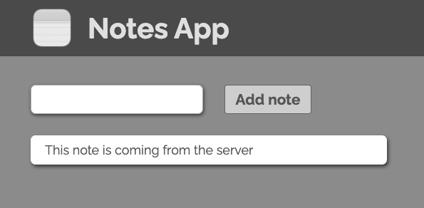
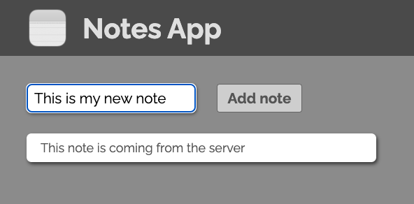
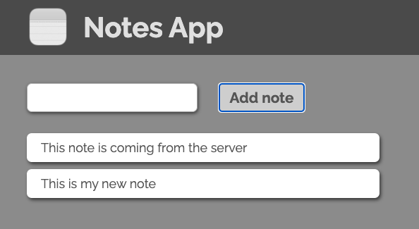

# Note App Frontend

    
    
    
    
    
    
    
    
 

[What is MVC?](#what-is-mvc) | [Why MVC?](#why-mvc) | [This repository](#this-repository) | [How to use](#how-to-use) | [Testing](#testing) | [Screenshots](#screenshots)

This small project is a simple frontend for a note app built using the MVC pattern. It is built using vanilla JavaScript and tested using Jest.
It was made as a simple introduction to MVC during the Maker's Academy Softare Engineering course.

It uses a companion [backend](https://github.com/pablisch/notes-app-backend-server) to store the notes which are non-persistant.

NOTE: Since there is no database, the notes will be lost when the server is restarted.

## What is MVC?

MVC is a software architecture pattern for developing web applications. It is a way of structuring the codebase of an application into three distinct logical components: the Model, the View and the Controller. The MVC pattern is a way of separating the concerns of an application into three distinct parts, each with separate responsibilities.

## Why MVC?

The MVC pattern is a way of separating the concerns of an application into three distinct parts, each with separate responsibilities. This separation of concerns allows for the application to be more modular, and for the codebase to be more maintainable and scalable.

## This repository

This repository contains a simple example of a web application built using the MVC pattern. The application is a simple blog built to reinforce my own learning follwing the introduction of MVC in the Makers Academy course.

## How to use

1. Clone this repository
2. Install dependencies with `npm install`
3. Build the project with `npm run build`
4. Run `open index.html` to open the application in your browser

NOTE: The app will only function properly if the backend server is running. See the [backend repository](https://github.com/pablisch/notes-app-backend-server).

## Testing

This project uses Jest for testing. To run the tests, run `jest` in the terminal.

## Screenshots

The main page of the app on opening:

Adding a note:

Viewing all notes with added note:

